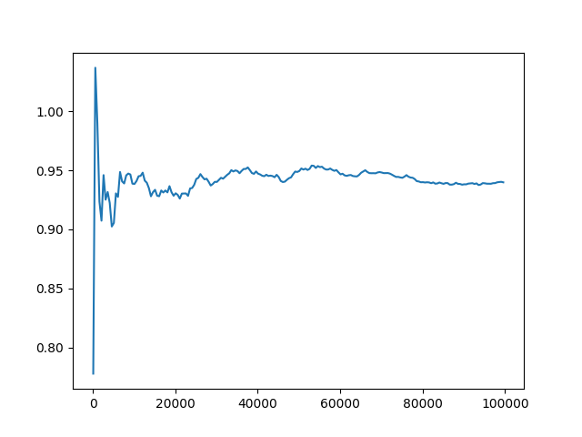
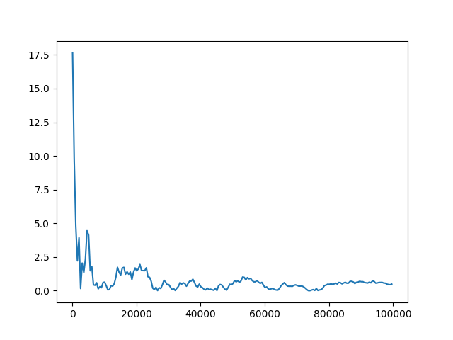

# Сравнительный анализ

Все файлы можно найти по [ссылке](https://github.com/zemld/Hse-algorithms-Set-3-part-A)

ID посылки: 292305114

В коде файла `getting_data.cpp` мы получаем данные о площади пересечения заданных кругов. А также данные об отклонении площади в зависимости от количества брошенных точек. Полученные данные записаны в файлы `square.csv` и `deviation.csv`.
Код из файла `create_graphics.py` парсит данные и строит графики.
График площади от количества точек выглядит так:

А график отклонения площади от точной (которая равна $0.25\cdot\pi + 1.25\cdot\arcsin(0.8) - 1$) в процентах выглядит так:

Из графиков можно видеть, что с увеличением количества брошенных точек площадь становится все ближе к точному значению. Однако начиная с примерно 30000 точек результат алгоритма Монте-Карло отличается от точного не более, чем на 1%.
