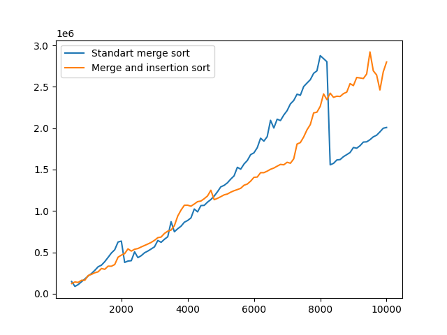
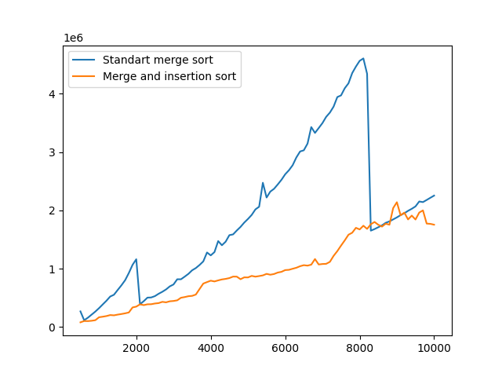
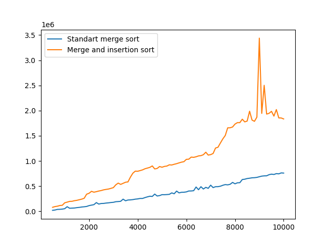

# Сравнительный анализ

Все файлы можно найти по [ссылке](https://github.com/zemld/Hse-algorithms-Set-3-part-A)

ID посылки: 292496100

Я сравнивал скорость работы алгоритма сортировки, использующего сортировку слиянием и сортировку вставками при условии, что размер массива меньше 15, и встроенного в C++ алгоритма `mergeSort` (`std::stable_sort`).

Для массива, заполненного случайными числами, графики зависимости времени сортировки (в наносекундах) от размера массива выглядят так:

Можно видеть, что при размере массива до 5000 элементов встроенный алгоритм сортировки работает быстрее. При количестве элементов от 5000 до 8000 встроенный алгоритм сортировки работает медленнее. А при количестве элементов от 8000 до 10000 алгоритм, переключающийся между сортировкой слиянием и сортировкой вставками, работает медленнее.

Для массива, заполненного числами от большего к меньшему, графики зависимости времени сортировки (в наносекундах) от размера массива выглядят так:

Для массива такого типа встроенный алгоритм почти всегда работает медленнее.

Для почти отсортированного массива графики зависимости времени сортировки (в наносекундах) от размера массива выглядят так:

Для такого массива встроенный алгоритм сортировки почти всегда работает быстрее.
