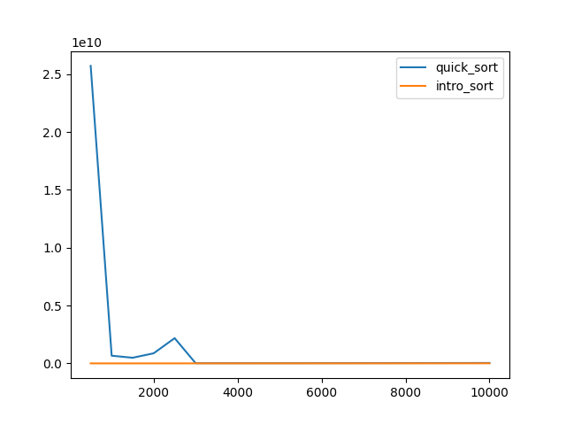
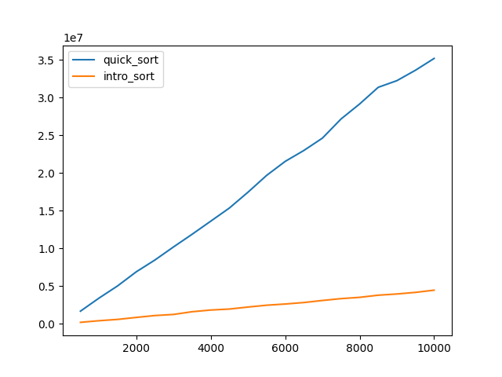
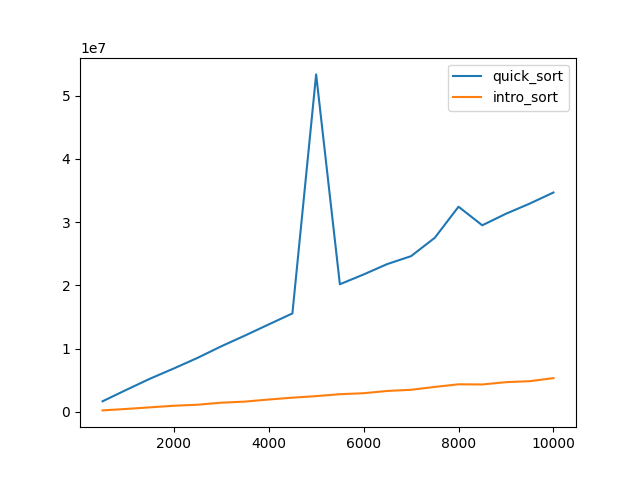

# Сравнительный анализ

Все файлы можно найти по [ссылке](https://github.com/zemld/Hse-algorithms-Set-3-part-A)

ID посылки: 292670966

Я замерил время сортировки массивов разного типа (почти отсортированных, отсортированных в обратном порядке, числа в которых расположены случайным образом) для двух сортировок - quick_sort и intro_sort. Я построил графики, которые соответствуют нашим измерениям.

Можно видеть, что лишь для почти отсортированного массива при большом количестве элементов время, которое тратят алгоритмы, приблезительно совпадает. Однако на малом количестве элементов обычный quick_sort работает дольше.

Также время работы quick_sort для массивов из случаных элементов и массивов, элементы которых расположены в обратном порядке, гораздо больше времени работы intro_sort. Кроме того, время работы quick_sort растет гораздо быстрее.

Из этого можно сделать вывод, что intro_sort работает быстрее, чем quick_sort, почти во всех случаях.
